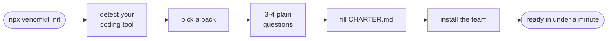
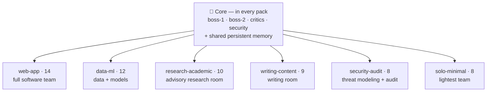
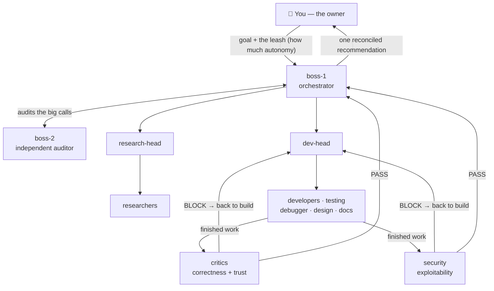

# Venom

**Give any coding-agent user a whole company of specialists instead of one generalist.**

Venom scaffolds a named team of role-based AI agents — a boss, researchers, developers, reviewers, a
security auditor — with shared, persistent memory, into any project. One command drops the team in;
you drive it through your coding agent.

[](https://www.npmjs.com/package/venomkit)
[](LICENSE)
[](https://nodejs.org)
[](package.json)

---

## The honest pitch

A single coding agent is **one generalist**: it forgets between sessions, reviews its own work, and
holds one perspective.

Venom gives you a **team**: specialized roles, independent review gates a generalist skips, and a
memory that persists across sessions and survives context resets. So you **catch more, forget less,
and work with more rigor.**

That's the whole claim. No "10x", no magic — just structure a solo agent doesn't have. The honesty is
the point: it's why you can trust the parts Venom *does* do.

## Quickstart

```bash
cd your-project
npx venomkit init
```

`init` asks **which coding tool you use** (Claude Code, Codex, or Gemini) and what kind of work you
do, fills a project **Charter**, writes the memory scaffold, and installs the agents where that tool
looks for them — in under a minute, no config editing. Then open the project in that tool and give
**boss-1** your first goal.

Prefer non-interactive? Name the tool and pack directly:

```bash
npx venomkit init --tool codex --pack web-app --yes   # or --tool gemini / claude-code
```

> **Requirements:** a coding agent you already use — **[Claude Code](https://claude.com/claude-code)**,
> **[Codex](https://github.com/openai/codex)**, or **[Gemini CLI](https://github.com/google-gemini/gemini-cli)** —
> and **Node.js ≥ 18.17**. Venom is for developers comfortable in a terminal; it doesn't try to be a
> no-terminal GUI.



## What gets installed

```
your-project/
├── CHARTER.md            # your project's constitution — identity, non-negotiables, scope (yours to edit)
├── CLAUDE.md             # briefs your lead session to operate as boss-1, and loads the Charter
├── .claude/
│   ├── agents/           # your team, as individual agent files
│   └── settings.json     # safe permissions (allow reads · ask before impact · deny danger)
├── agent-memory/         # the team's shared, persistent memory (SNAPSHOT, logs, lessons, ADRs)
└── .venom/
    ├── workflow.md       # your guide to driving the team
    └── install.json      # install record (pack, roles, version) — used by re-init and `add`
```

Nothing is clobbered on re-run: your `CHARTER.md`, your own notes in `CLAUDE.md`, your existing
`settings.json` rules, and your live `agent-memory/` are all preserved.

> That's the **Claude Code** layout. `--tool codex` installs the same team as an `AGENTS.md` brief
> plus `.venom/agents/` role specs; `--tool gemini` installs it as `GEMINI.md` plus `/venom:<role>`
> slash-commands under `.gemini/commands/`. Same core, same memory — mapped to each tool's native shape.

## The two ideas that make it a team (not a pile of prompts)

1. **Shared, persistent memory.** Agents don't chat live — they coordinate through files under
   `agent-memory/`, read before acting and written after. One agent's result becomes the next agent's
   starting point, and it all survives a context reset. Governing rule: *write everything, read
   selectively.*
2. **Two independent review gates.** Before anything is called done, it passes **critics**
   (correctness + your Charter's non-negotiables) and **security** (exploitability) — both read-only,
   both must pass. They flag and block; they never fix. You make the final call.

## Packs — pick the team that fits your work

Every pack ships the same core four (`boss-1`, `boss-2`, `critics`, `security`) plus the full memory
tier. They differ only in the specialists:



| Pack | Agents | Best for |
|------|:------:|----------|
| **web-app** _(default)_ | 14 | Web apps, APIs, CLIs, general software |
| **data-ml** | 12 | Data pipelines, ETL, model training & evaluation |
| **research-academic** | 10 | Literature reviews, study design, rigorous written research |
| **writing-content** | 9 | Articles and docs where the claims must hold up |
| **security-audit** | 8 | Security reviews and audits of an existing codebase |
| **solo-minimal** | 8 | A solo dev who wants review + memory without the full org |

```bash
npx venomkit list            # see the packs and roles
npx venomkit init --pack solo-minimal
```

## How you drive the team

You talk to **boss-1** — one point of contact, not the whole roster. You give it a goal and set the
**leash** (how much autonomy to take); it decomposes the goal, delegates to the right specialists,
runs the review gates, and brings back **one reconciled recommendation**. You approve what matters.

The full daily-use guide — the leash, the gates, the quality loops, a troubleshooting table, and what
to expect — is installed at **`.venom/workflow.md`**.

Behind that one conversation, the whole team is at work:



Only the bosses talk to you; the gates and boss-2 report to boss-1 directly. **Both gates must be
green before anything ships** — and you make the final call.

## What Venom is NOT (so you can trust what it is)

- **Not an autonomous company that runs while you sleep.** Today's tools can't deliver reliable
  unsupervised multi-agent autonomy, and Venom doesn't pretend to. You're the driver.
- **Not a productivity-multiplier with a number.** It gives you structure, review, and memory — not a
  guaranteed multiple.
- **Not infallible.** The gates make the work more rigorous, not perfect. The final call is always
  yours.

## How it works

A **tool-agnostic core** holds the value — the agent roles (portable Markdown), the memory protocol,
the workflow, and the packs. Thin **per-tool adapters** map that core into whatever a specific coding
tool expects. This is what lets one framework target many tools without rewriting the brain.

```
venom/
├── core/            # tool-agnostic: agents/, memory-template/, workflow.md, packs.json, CHARTER_TEMPLATE.md
├── adapters/
│   ├── claude-code/ # core → .claude/agents/ subagents + settings.json
│   ├── codex/       # core → AGENTS.md brief + .venom/agents/ role specs
│   └── gemini/      # core → GEMINI.md + .gemini/commands/venom/ slash-commands
├── bin/             # the venom CLI entry
└── src/             # the CLI (TypeScript → dist/; zero runtime dependencies)
```

Project specifics live only in the generated `CHARTER.md`; the agent specs stay generic and read the
Charter at runtime. Each adapter maps that one core onto its tool's **native** primitives — so the
team is real in each, and each adapter's README notes exactly where a tool's mechanism differs (e.g.
Claude Code trims each role's tools — the `critics`/`security` gates get no Edit/Write; Codex and
Gemini carry that as instruction plus the tool's own sandbox). Adapters ship as plain ESM + JSON with no build step — so
adding a tool is one file, not a rewrite.

**Deeper diagrams** — the core↔adapter mapping, how agents coordinate through shared memory, and the
review loop — are in **[docs/ARCHITECTURE.md](docs/ARCHITECTURE.md)**.

## The roster

**Core (every pack):** `boss-1` (orchestrator) · `boss-2` (independent auditor) · `critics`
(correctness/trust gate) · `security` (exploitability gate).

**Specialists (assembled per pack):** `research-head` · `dev-head` · `tech-researcher` ·
`domain-researcher` · `developer-1` · `developer-2` · `testing` · `debugger` · `design` ·
`technical-writer` · `data-engineer` · `ml-engineer` · `literature-reviewer` · `methodologist` ·
`editor` · `fact-checker` · `threat-modeler` · `pentester-advisor`. Plus an optional `marketing`
add-on (`venom add marketing`).

## CLI reference

```
venom init [options]      Install a team into the current project
venom list                Show the available packs and roles
venom add <role>          Add an optional role to an existing install
venom tokens [--pack <id>]  Estimate token footprint + cost across models/presets
venom models [preset]     Show or switch the model preset (quality | balanced | budget)
venom --version           Print the version
venom --help              Full help

init options:
  --pack <id>             web-app | data-ml | research-academic | writing-content | security-audit | solo-minimal
  --name <name>           Project name (default: folder name)
  --one-liner <text>      One-line description of the project
  --non-negotiables <t>   Rules that must never be broken (separate with ';')
  --out-of-lane <text>    What the project deliberately won't do
  --tool <id>             claude-code (default) | codex | gemini  (auto-detected if omitted)
  --models <preset>       quality | balanced (default) | budget  — cost/quality tradeoff
  --dir <path>            Target directory (default: current)
  --force                 Overwrite an existing CHARTER.md
  --yes, -y               Non-interactive: use flags + defaults
```

**Token control.** `venom tokens` estimates the per-turn and per-goal footprint and the cost across
models, and compares the presets. `venom models budget` downshifts the workers to a cheaper model —
per-role on Claude Code (real, in each subagent's frontmatter); a recommended session model on
Codex/Gemini. Run `venom tokens` before and after to see the delta.

## Extend it

Venom is built to be extended:

- **Add a pack** — one entry in `core/packs.json` referencing existing roles.
- **Add a role** — a portable spec in `core/agents/` plus a manifest entry per adapter.
- **Add a tool adapter** — one self-contained ESM module. Three ship today as reference
  implementations: `adapters/claude-code`, `adapters/codex`, and `adapters/gemini`.

See the wiring diagram in **[docs/ARCHITECTURE.md](docs/ARCHITECTURE.md#wire-it-to-your-needs)** and the
full steps in [CONTRIBUTING.md](CONTRIBUTING.md).

## Development

```bash
git clone <this-repo> && cd venomkit
npm install          # dev-only deps (TypeScript); the published package has zero runtime deps
npm test             # builds, then runs the adapter + CLI test suites
npm run build        # compile the CLI to dist/
```

## License

[MIT](LICENSE).
