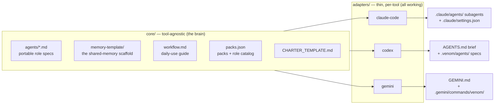
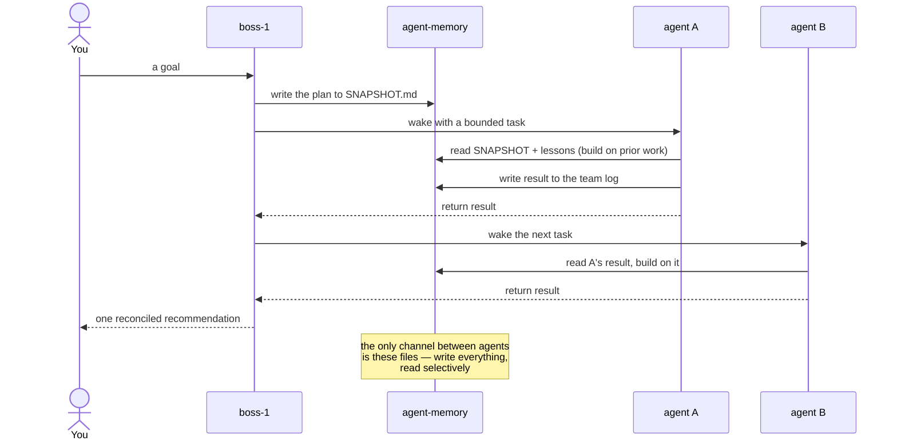
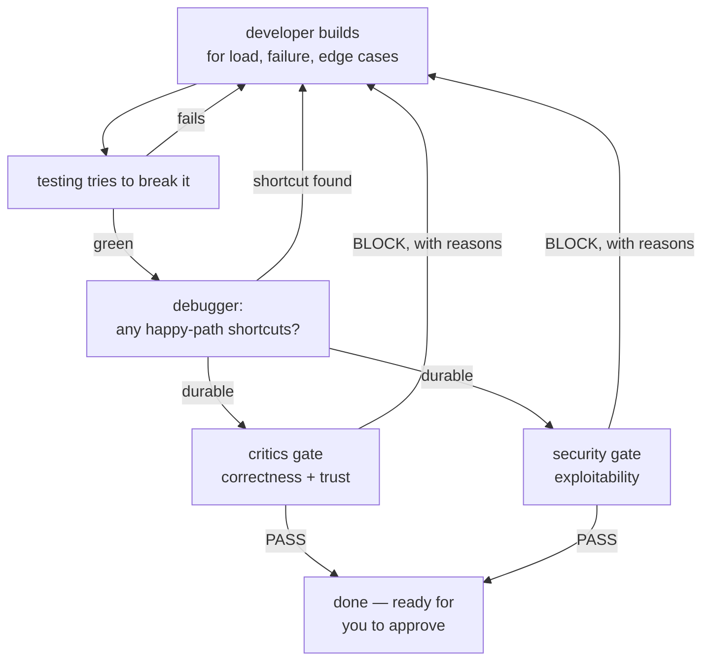
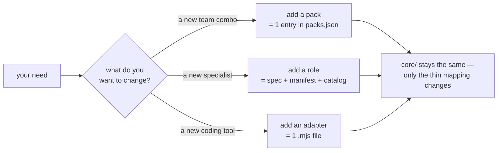

# Architecture & wiring

How Venom is put together, how the agents actually coordinate, and how you extend it. The
higher-level "how your team works / install / packs" diagrams live in the [README](../README.md);
this doc goes deeper.

---

## Tool-agnostic core + thin adapters

The value lives in a **tool-agnostic core** — the roles, the memory protocol, the workflow, the
packs. A **thin per-tool adapter** maps that core into whatever a specific coding tool expects. One
brain, many tools.

All three also write the shared, tool-agnostic surfaces: `CHARTER.md`, `agent-memory/`, and
`.venom/`. Each adapter maps the same core onto that tool's **native** primitives — Claude Code's
subagents, Codex's `AGENTS.md`, Gemini's `GEMINI.md` + slash-commands — and each adapter's README
notes exactly where a tool's mechanism differs (e.g. Claude Code enforces the read-only gates by
tool permission; Codex and Gemini carry that constraint as instruction plus the tool's own sandbox).

The agent specs never contain tool syntax or project specifics — a project's details live only in
the generated `CHARTER.md`, which every agent reads at runtime. Adapters ship as plain ESM + JSON
with no build step, so adding a tool is one file, not a rewrite.

---

## How the agents coordinate (shared memory, not live chat)

Agents run in isolation — one cannot see another while it works. They coordinate through **files**
under `agent-memory/`, read before acting and written after, with boss-1 sequencing the work. It is
honest sequential coordination, not telepathy — and it survives a context reset.

`SNAPSHOT.md` is the live activity board everyone reads first; team `log.md` files are the durable
record; `lessons/` and `adr/` mean a mistake or decision made once informs every agent afterward.

---

## The review loop — nothing ships unreviewed

Work goes through a build/test/debug loop, then two independent, read-only gates. Both must pass;
either one blocks. The gates flag and block — they never fix — so they stay honest checks.

For non-code packs (research, writing) the gate is critics against your Charter; security applies
wherever there is code or config to exploit.

---

## Wire it to your needs

Venom is built to extend. The `core/` layer never changes for a new need — only the thin mapping does.

- **Add a pack** — one entry under `packs` in `core/packs.json` whose `adds` reference existing roles.
  Keep reporting lines resolvable (a worker whose head isn't in the pack needs a `reportsToFallback`).
- **Add a role** — a portable spec in `core/agents/`, a `roles` catalog entry, and a per-adapter
  manifest entry (`model`, `tools`, `description`).
- **Add a tool adapter** — one ESM module exporting `meta` + `install(opts)`. Three ship today as
  reference implementations: [`claude-code`](../adapters/claude-code/README.md),
  [`codex`](../adapters/codex/README.md), and [`gemini`](../adapters/gemini/README.md).

Full steps are in [CONTRIBUTING.md](../CONTRIBUTING.md).
